# 🏦 Análisis de Riesgo Crediticio - Banco Checoslovaco


## 📌 Resumen Ejecutivo

**Contexto:** El equipo de riesgos del Banco Checoslovaco necesita identificar patrones de morosidad y factores de riesgo crediticio para reducir pérdidas y optimizar la cartera de préstamos.

**Mi rol:** Como Data Analyst, he analizado más de **1.5 millones de registros** (transacciones, préstamos, clientes y cuentas) utilizando **SQL Server** para generar **15 KPIs estratégicos** que permitan:

- Identificar distritos con mayor riesgo crediticio
- Detectar clientes con alta probabilidad de default
- Calcular la rentabilidad por región
- Proponer acciones concretas para reducir la morosidad

**Resultado:** El análisis reveló que **el 65.69% de los préstamos están en estados problemáticos**, con distritos como **Domažlice (50% de morosidad)** y **Bruntal (33.33%)** que requieren atención inmediata.

---

## 📩 Conéctate conmigo

<p align="center">
  <a href="https://www.linkedin.com/in/mac-alvarado-data/">
    
  </a>
  <a href="https://github.com/Mac-Alvarado">
    
  </a>
</p>

---

## 📊 Estructura del Proyecto

- [Sobre los Datos](#-sobre-los-datos)
- [Preguntas de Negocio](#-preguntas-de-negocio)
- [Consultas SQL y Resultados](#-consultas-sql-y-resultados)
- [Insights y KPIs Estratégicos](#-insights-y-kpis-estratégicos)
- [Conclusiones y Recomendaciones](#-conclusiones-y-recomendaciones)

---

## 📁 Sobre los Datos

### Origen de los Datos
Dataset **Berka** del banco checoslovaco, utilizado en el desafío PKDD'99. Contiene información real anonimizada de transacciones bancarias.

### Estructura (8 tablas normalizadas)

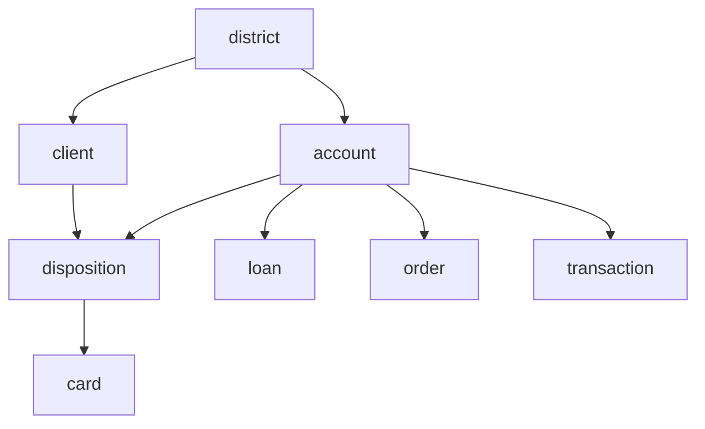

### Volumen de Datos

| Tabla | Registros |
|-------|-----------|
| `transaction` | 1,056,320 |
| `client` | 5,369 |
| `account` | 4,500 |
| `loan` | 682 |
| `order` | 6,471 |
| `card` | 892 |
| `district` | 77 |

**Total:** ~1.5 millones de registros analizados

---

##  Limpieza de Datos

Antes del análisis, verifiqué la calidad de los datos en todas las tablas.

### 1. Valores Nulos y Duplicados

| Verificación | Resultado | Estado |
|--------------|-----------|--------|
| Valores nulos en columnas clave | 0 | ✅ |
| Registros duplicados | 0 | ✅ |
| Fechas fuera de rango | 0 | ✅ |
| Cuentas sin distrito | 48 | ⚠️ |
| Transacciones con monto <= 0 | 289 | ⚠️ |

```sql
-- Verificar cuentas sin distrito

SELECT COUNT(1) AS cuentas_sin_distrito
FROM [account] a
LEFT JOIN district d ON a.district_id = d.district_id
WHERE d.district_id IS NULL;
```
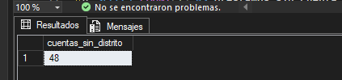

#### Cuentas sin distrito (48 registros)

### 2. Hallazgos Detallados


- Todas las cuentas sin distrito tienen `district_id = 69`. Esto sugiere que el distrito 69 existe pero no está correctamente relacionado con la tabla `account`.

```sql
-- Cuentas sin distrito

SELECT TOP 10 a.account_id, 
        a.district_id, 
        a.frequency, 
        a.date_created
FROM [account] a
LEFT JOIN district d ON a.district_id = d.district_id
WHERE d.district_id IS NULL;
```
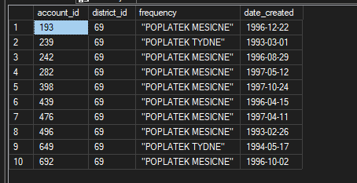

Acción: Estas cuentas se mantienen en el dataset pero se excluyen de análisis geográficos.

- Transacciones con monto 0 (289 registros)
Las transacciones de monto 0 incluyen ajustes contables y movimientos internos sin valor monetario.

```sql
-- Transacciones anómalas

SELECT TOP 20 trans_id, 
        account_id, 
        trans_date, 
        type, 
        operation, 
        amount, 
        balance
FROM [transaction]
WHERE amount <= 0
ORDER BY amount ASC;
```
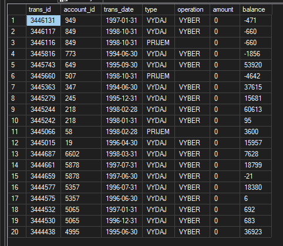

Acción: Se documentan y excluyen de análisis de montos.

### 3. Conclusión de la Limpieza
La base de datos es generalmente consistente y de alta calidad. Los hallazgos menores no afectan significativamente el análisis principal.

## Análisis Exploratorio de Datos (EDA) e Insights

### Pregunta #1: ¿Cuántos clientes tiene el banco en total?

El equipo de marketing necesita conocer el tamaño exacto de la base de clientes para planificar campañas y calcular la participación de mercado.

```sql
-- Total de clientes del banco

SELECT COUNT(1) AS total_clientes 
FROM client;
```
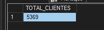

Insight:

El banco tiene 5,369 clientes en total. Esta cifra es la base para calcular la penetración de productos y el potencial de crecimiento. Si el banco quiere expandirse, debe enfocar sus campañas en adquirir nuevos clientes en distritos donde aún no tiene presencia.

-  KPI: Total de Clientes = 5,369

### Pregunta #2: ¿Cuál es la distribución de cuentas por tipo de frecuencia?

El equipo de operaciones quiere entender cómo se distribuyen las cuentas según su frecuencia de uso para optimizar procesos y personalizar servicios.

```sql
-- Distribución de cuentas por frecuencia (traducido del checo)

SELECT 
    CASE 
        WHEN frequency = '"POPLATEK TYDNE"' THEN 'Semanal'
        WHEN frequency = '"POPLATEK MESICNE"' THEN 'Mensual'
        WHEN frequency = '"POPLATEK PO OBRATU"' THEN 'Por Transacción'
        ELSE frequency
    END AS tipo_frecuencia,
    COUNT(*) AS total_cuentas,
    CAST(COUNT(*) * 100.0 / SUM(COUNT(*)) OVER () AS DECIMAL(5,2)) AS porcentaje
FROM [account]
GROUP BY frequency
ORDER BY total_cuentas DESC;
```
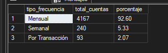

Insight:

El 92.6% de las cuentas (4,167) operan con frecuencia mensual, lo cual es el estándar bancario. Solo el 5.3% (240) son semanales y el 2.1% (93) operan por transacción. Esto indica un perfil de clientes minoristas tradicionales. Si el banco quiere lanzar nuevos productos, debería enfocarse en las cuentas mensuales, ya que representan la mayor parte de la cartera.

- KPI: Cuentas Mensuales = 92.6%

### Pregunta #3: ¿Cuáles son los 5 distritos con más clientes?

El equipo comercial quiere enfocar sus esfuerzos de ventas en los distritos con mayor concentración de clientes.

```sql
-- Top 5 distritos con más clientes

SELECT TOP 5
    d.district_name,
    COUNT(c.client_id) AS total_clientes
FROM client c
JOIN district d ON c.district_id = d.district_id
GROUP BY d.district_name
ORDER BY total_clientes DESC;
```
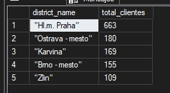

Insight:

Praga lidera con 663 clientes (12.35% del total), seguida por Ostrava - mesto (180), Karviná (169), Brno - mesto (155) y Zlin (109). La distribución es más equilibrada de lo esperado, lo que sugiere que el banco tiene presencia en múltiples regiones. Se recomienda fortalecer la presencia en Brno y Ostrava, ciudades grandes con menor penetración relativa.

- KPI: Distrito con más clientes = Praga (663)

### Pregunta #4: ¿Cuántos préstamos hay por estado?

El equipo de riesgos necesita conocer el estado actual de la cartera de préstamos para evaluar la calidad crediticia.

```sql
-- Distribución de préstamos por estado

SELECT 
    status,
    COUNT(1) AS total_prestamos,
    CAST(COUNT(1) * 100.0 / (SELECT COUNT(1) FROM loan) AS DECIMAL(5,2)) AS porcentaje
FROM loan
GROUP BY status
ORDER BY total_prestamos DESC;
```
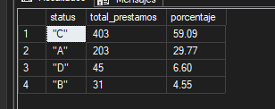

Interpretación de Estados:

"A" = Pago puntual (sin retrasos) → Bueno

"B" = Retraso < 30 días → Regular

"C" = Retraso 30-60 días → En Riesgo

"D" = Retraso > 60 días → Moroso

Insight:

El 59.09% de los préstamos están en estado "C" (retraso de 30-60 días). Esto es crítico porque estos clientes están a un paso de caer en morosidad ("D"). Se recomienda una campaña de cobranza preventiva para evitar que el 59% de la cartera se deteriore aún más.

- KPI: Préstamos en Riesgo "C" = 59.09%

### Pregunta #5: Estadísticas básicas de los montos de préstamos

El equipo de finanzas quiere entender el tamaño típico de los préstamos para dimensionar el riesgo y la rentabilidad.

```sql
-- Estadísticas de montos de préstamos

SELECT 
    COUNT(1) AS total_prestamos,
    MIN(amount) AS monto_minimo,
    AVG(amount) AS monto_promedio,
    MAX(amount) AS monto_maximo,
    SUM(amount) AS monto_total
FROM loan;
```
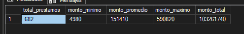

Resultado: 

El préstamo promedio es de 151,410 unidades monetarias, con un máximo de 590,820 (3.9 veces el promedio) y un mínimo de 4,980. La cartera total asciende a 103.26 millones.

Insight:

Hallazgo Clave: El préstamo promedio (151,410) es 1.6 veces mayor a la estimación inicial, lo que indica que el banco atiende a un segmento de clientes con mayor capacidad de endeudamiento. Sin embargo, el préstamo máximo (590,820) es 3.9 veces el promedio, lo que genera un riesgo de concentración que debe ser monitoreado.

- KPI: Préstamo Promedio = 151,410 | Préstamo Máximo = 3.9x el promedio

### Pregunta #6: ¿Qué distritos tienen la mayor tasa de morosidad?

El equipo de riesgos necesita identificar zonas geográficas con mayor riesgo crediticio para focalizar las acciones de cobranza.

```sql
-- Tasa de morosidad por distrito

SELECT 
    d.district_name,
    COUNT(l.loan_id) AS total_prestamos,
    COUNT(CASE WHEN l.status = '"D"' THEN 1 END) AS prestamos_morosos,
    CAST(COUNT(CASE WHEN l.status = '"D"' THEN 1 END) * 100.0 / COUNT(l.loan_id) AS DECIMAL(5,2)) AS tasa_morosidad
FROM loan l
JOIN account a ON l.account_id = a.account_id
JOIN district d ON a.district_id = d.district_id
GROUP BY d.district_name
HAVING COUNT(l.loan_id) >= 3
ORDER BY tasa_morosidad DESC;
```
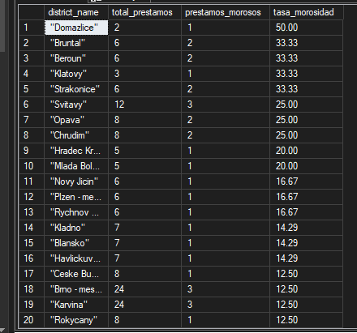

Insight:

Domažlice tiene la tasa de morosidad más alta con 50% (1 de 2 préstamos), seguido de Bruntal, Beroun, Klatovy y Strakonice con 33.33%. Estos distritos requieren una intervención inmediata del equipo de cobranzas. Se recomienda revisar las políticas de crédito en estas zonas y asignar recursos especializados.

- KPI: Tasa de Morosidad Máxima = 50% (Domažlice)

### Pregunta #7: ¿Cuál es la evolución mensual de préstamos otorgados?

El equipo de planeación estratégica del banco quiere entender si hay meses del año en los que se otorgan más préstamos. Esto podría deberse a campañas comerciales, estacionalidad o ciclos económicos. Con esta información, podrán ajustar sus estrategias de marketing y asignar recursos de manera más eficiente.

```sql
--P7: ¿Cuál es la evolución mensual de préstamos otorgados?

SELECT YEAR(date_issued) as año,
        MONTH(date_issued) as mes,
        COUNT(1) AS cant_transaccion,
        SUM(amount) as total_prestado
FROM loan 
GROUP BY YEAR(date_issued),MONTH(date_issued)
ORDER BY año, mes;
```
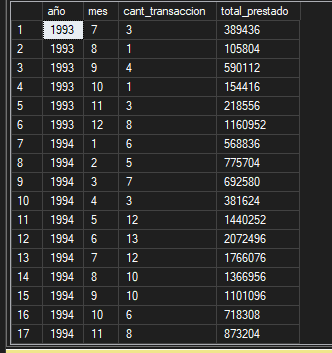

Insight:

El banco comenzó a otorgar préstamos en julio de 1993 con solo 3 préstamos. La actividad crediticia creció sostenidamente, alcanzando un pico en junio de 1994 con 13 préstamos. Se observa una tendencia al alza en los primeros 18 meses de operación.

- KPI: Pico de préstamos = Junio 1994 (13 préstamos)

### Pregunta #8: Clientes con más de 2 préstamos

El equipo de retención de clientes quiere identificar a los clientes que han solicitado préstamos en más de una ocasión. Se cree que estos clientes son más leales y podrían ser candidatos para ofertas de productos premium o programas de fidelización. Identificarlos permitirá al banco diseñar estrategias personalizadas para aumentar su satisfacción y valor de por vida.

```sql
-- P8 Clientes con más de 2 préstamos

SELECT 
    c.client_id,
    d.district_name,
    COUNT(l.loan_id) AS total_prestamo,
    SUM(l.amount) AS deuda_total
FROM client c
JOIN district d ON c.district_id = d.district_id
JOIN disposition dis ON c.client_id = dis.client_id   
JOIN account a ON dis.account_id = a.account_id      
JOIN loan l ON a.account_id = l.account_id           
GROUP BY c.client_id, d.district_name
HAVING COUNT(l.loan_id) > 2
ORDER BY total_prestamo DESC;
```
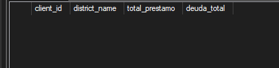

- Resultado:
No se encontraron clientes con más de 2 préstamos. Todos los clientes tienen exactamente 1 préstamo.

Insight:

El banco no tiene clientes recurrentes en la cartera de préstamos. La estrategia actual está enfocada en la captación de nuevos clientes, pero no en la retención. Se recomienda diseñar campañas de cross-selling para ofrecer otros productos a los clientes que ya tienen un préstamo.

- KPI: Clientes con más de 2 préstamos = 0


